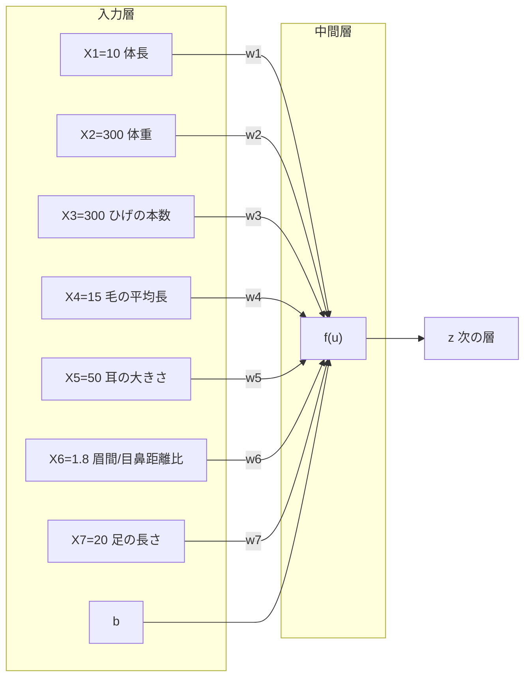

# Study-AI 実装演習レポート

## 深層学習day1 Section1（入力層～中間層）

### 1. 要点まとめ

機械学習は、識別器の開発を目的としている。識別器の開発には識別モデル、生成モデル、識別関数の３つのアプローチがある。
ニューラルネットワークの全体像は「入力層／中間層／出力層」から構成される。

- 問）ディープラーニングは何を使用しようとしているのか？
  - 解）明示的なプログラムの代わりに、多数の中間層を持つニューラルネットワークを用いて、入力値から目的とする出力値に変換する数学モデルを構築すること。

- 問）次の中のどの値の最適化が最終目的か？
（選択肢：①入力値[X] ②出力値[Y] ③重み[W] ④バイアス[b] ⑤総入力[u] ⑥中間層入力[z] ⑦学習率[ρ]）
  - 解）③重み[W]、④バイアス[b]

ニューラルネットワークでできることの例。
- 回帰
  - 結果予想（売上予想、株価予想）
  - ランキング（競馬順位予想、人気順位予想）
- 分類
  - 猫写真の分類
  - 手書き文字識別
  - 鼻の種類分類

### 2. 実装演習
（１）ネットワーク図に動物種類分類の実例を入れよ。

### 3. 確認テストなどの考察

（５）このコードをPythonで書け。
u=w1x1+w2x2+w3x3+w4x4+br=Wx+b
⇒

（６）1-1のファイルから中間層を定義しているソースを抜き出せ。

### 4. 関連記事

